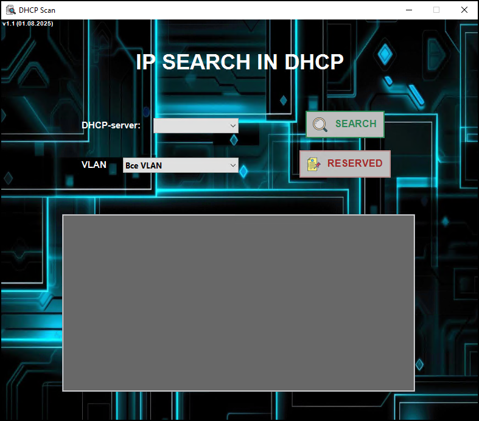
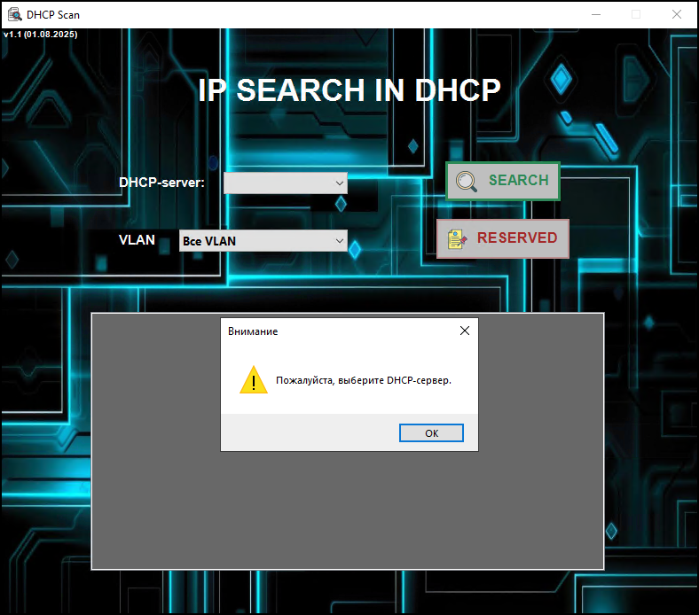
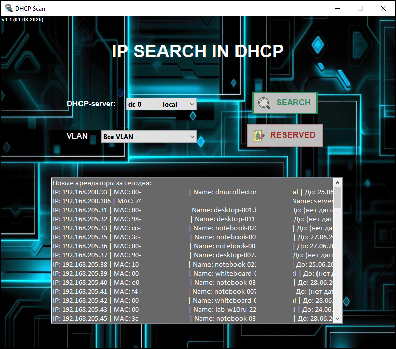

# DHCPScan
Скрипт предназначен для мониторинга DHCP-серверов с целью выявления новых аренд IP-адресов, а также для просмотра зарезервированных IP-адресов.
Он реализован в двух режимах:

CLI (командная строка) — автоматический режим для задач типа Task Scheduler;

GUI (графический интерфейс) — визуальный режим с интерактивной формой и удобным управлением.

CLI-режим (командная строка)  
Используется для автоматизации (например, через Task Scheduler).  
Функции:
- Поиск новых IP-аренд по сравнению со вчерашними;
- Фильтрация по VLAN;
- Логирование в CSV;
- Отправка отчёта на почту;
- Очистка старых логов.

GUI-режим (графический интерфейс)  
Интерактивная форма для ручного использования.  
Функции:
- Выбор DHCP-сервера и VLAN;
- Поиск новых арендаторов IP;
- Просмотр зарезервированных IP-адресов;
- Удобный вывод результатов в списке.

## Скриншоты (Графический интерфейс)

### Главное окно  

Для поиска необходимо выбрать DHCP-сервер

Нажать кнопку SEARCH

